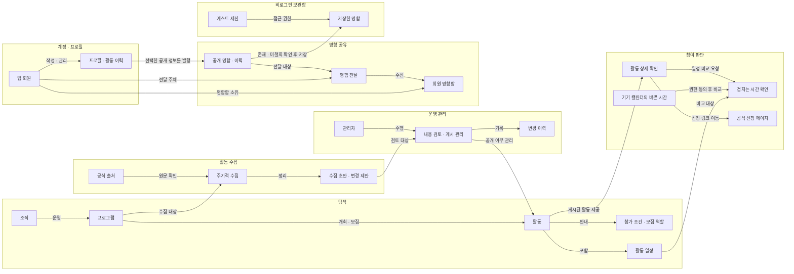

# Dearby 도메인 도식도

기준일: 2026-09-30. 현재 구현된 개념을 업무 영역별로 묶은 도식이다. 영역 구분은 설명을 위한 것이며 독립된 서버나 코드 모듈 경계를 의미하지 않는다.

## 전체 도메인 관계

## 도메인별 역할

| 영역 | 역할 |
| --- | --- |
| 탐색 | 조직 → 프로그램 → 활동을 연결하고 참가 조건과 일정을 제공한다. |
| 활동 수집 | 프로그램별 공식 출처를 확인해 활동 초안과 변경 제안을 만든다. |
| 운영 관리 | 관리자가 내용을 검토하고 공개 상태를 관리하며 변경 이력을 남긴다. |
| 참여 판단 | 활동 상세와 일정 겹침을 확인한 뒤 외부 공식 페이지에서 신청한다. |
| 계정 · 프로필 | 앱 회원의 프로필과 활동 이력을 관리한다. |
| 명함 공유 | 선택한 공개 정보를 명함으로 발행하고 전달·수신한다. |
| 비로그인 보관함 | 로그인 없이 게스트 세션으로 명함을 저장하고 다시 열람한다. |

## 현재 동작을 해석할 때의 경계

- 수집 결과는 자동으로 공개되지 않는다. 게시 상태인 활동만 사용자 탐색에 제공한다. 기존 초안의 자동 갱신 여부는 관리자 수정 여부에 따라 달라진다.
- 신청은 외부 공식 페이지로 이동한다. 이 그림은 Dearby 내부에서 신청 접수까지 처리한다는 뜻이 아니다.
- 캘린더는 사용자 동작과 기기 권한 동의 후 바쁜 시간만 비교한다. 개인 일정 내용은 서버에 수집하지 않는다.
- 명함은 발행 시점의 공개 정보다. 프로필 수정이 기존 명함에 자동 반영되지는 않는다.
- 게스트 보관함의 접근 권한은 세션 토큰으로 확인한다. 명함 주소의 식별자만으로 다른 사람의 보관함에 접근할 수 없다.
- 게스트 세션에는 서버 자동 만료가 없지만, 브라우저 쿠키 삭제나 명시적인 세션 삭제로 접근이 끊길 수 있다.
- 관리자 인증과 앱 회원 인증은 별개다.
- 명함 기능의 구현·보존과 기본 네이티브 화면 노출은 구분한다. 기본 네이티브 흐름은 탐색 → 상세 → 신청과 일정 겹침 확인이다.

## 확인 기준

main `f07210f8a4bb16736a4553085eb787025ff52581`의 저장 구조와 앞서 확인한 기능 계약을 바탕으로 작성했다. 이번 수정은 설명 문서만 변경하며 운영 연결이나 배포 상태를 새로 검증한 결과가 아니다.
