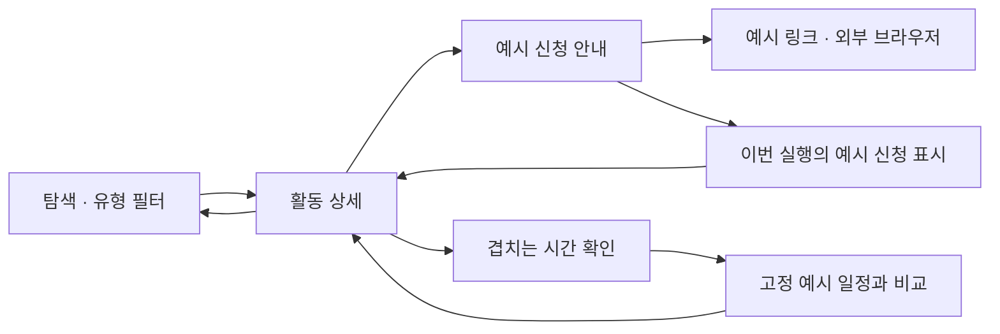
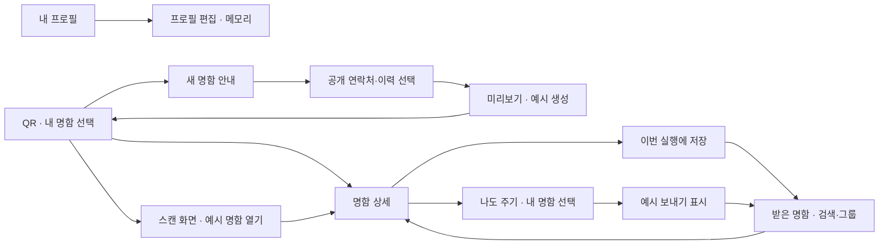

# 모바일 UI 프로토타입

2026-10-03 사용자 승인. iOS·Android에서 현재 디자인과 화면 이동을 파악하기 쉽도록 실제 서비스 실행 로직을 걷어내고 예시 데이터로 동작하게 한다.

## 범위

- 유지 및 추가 반영: selected 폴더의 탐색·상세·신청 상태·프로필·명함·QR·명함함 시각 디자인, 로고·이미지 자산, 필터·뒤로 가기·시트 등 화면 이동. 후속 사용자 승인으로 다섯 탭과 모든 명함 화면을 예시 UI로 다시 포함한다.
- 대체: 활동과 바쁜 시간을 고정 예시로 제공하고 신청 표시 등 화면 상태는 메모리에서만 변경한다. 실제 접수나 캘린더 연동으로 표현하지 않는다.
- 제거: 모바일 API 호출·인증·영구 저장·OS 캘린더·카메라 접근 및 서비스 실행 코드와 의존성. QR 스캔·로그인·명함 보내기·저장은 예시 결과와 메모리 상태로만 이어진다.
- 보존: 서버·웹·어드민·수집 워커·운영 DB, 기기에 이미 있는 앱 저장 데이터. 앱 초기화나 데이터 삭제는 수행하지 않는다.

## 복구

변경 전 main: `82ae19f18c4f10ccfaf3a504f16b63ae07e485ac`.
원격 복구 태그: `backup/mobile-service-before-prototype-20261003`.

이 문서는 프로토타입을 실제 서비스 완료로 간주하지 않는다. 원래 서비스 기능이 필요하면 복구 태그와 서버 계약을 참고해 별도 작업으로 다시 연결한다.

## 공통 예시

| 활동 | 유형 | 표시 상태 | 일정 (서울 시간) |
| --- | --- | --- | --- |
| Dearby 개발자 컨퍼런스 | 참가등록형 | 예시 모집 중 | 2026-10-24 13:00–17:00 |
| Dearby 메이커 캠프 | 선발형 | 예시 모집 중 | 2026-11-07 10:00–18:00 |
| Dearby 커뮤니티 밋업 | 참가등록형 | 예시 모집 예정 | 2026-11-21 14:00–17:00 |

고정 바쁜 시간은 2026-10-24 14:00–15:00이며 실제 사용자 일정이 아니다. 날짜가 지나도 예시 모집 상태는 바뀌지 않는다. 예시 URL은 `https://example.com`이며 실제 신청 사이트가 아니다.

## 명함 화면 이동

후속 승인으로 다음 흐름도 예시 화면으로 포함한다. 실제 계정과 명함 데이터에는 접근하지 않는다.

## 디자인 기준

`01a0dd49-8ce1-7263-957a-d63f220da862/selected` 재귀 조사: 현재 흐름 5장, 기타 화면 11장, 로고 2장, 캘린더 후보 4장. 화면 16장과 로고 2장은 기존 `docs/design/approved` 사본과 대응한다. 캘린더는 사용자 직접 지정 [A안](../design/approved/calendar-overlap-a.png)을 적용한다. B/C 및 다른 후보를 섞지 않는다.

최신 범위·시안 대응은 [프로토타입 디자인 적용표](../design/mobile-prototype-reference-map.md)에서 확인한다.

## 진행 상태

2026-10-04 iOS·Android의 다섯 탭과 시안별 예시 흐름을 root 작업 브랜치에 통합했다.
실제 계정·캘린더·카메라·영구 저장 대신 고정 예시와 메모리 상태를 사용한다.

| 검증 | 결과 |
| --- | --- |
| iOS | SwiftLint 위반 0, 구조 17, 단위 9, 화면 흐름 9 통과. 후속 여백 조정과 큰 글씨의 관련 재검사 이력은 iOS 인계에 구분 기록. |
| Android | 빌드, 단위 12, 구조 자가검사 25, 화면 흐름 9 및 최종 QR/글자 1.3배 검사 통과. lint 오류 0, 의존성 버전 안내 경고 6. |
| root 통합 빌드 | iOS 실기기 Release 개발 서명 빌드와 Android Debug APK 빌드 성공. |
| iPhone 14 Pro Max | Wi-Fi로 기존 앱에 업데이트 설치·실행, 활동 상세와 일정/겹침 확인 진입 화면 캡처 확인. |
| Android SM-S938N | Wi-Fi 업데이트 설치·실행 성공. 사용자 잠금 해제 후 실제 탐색 화면의 사진·유형 필터·다섯 탭 캡처를 확인했다. |
| 자산 | 공통 원본 4개와 양쪽 네이티브 사본의 SHA-256 일치. |
| 변경 범위 | 서버·웹·어드민·Supabase·기존 데이터/계약·워크플로 파일 변경 없음. 운영 DB 작업 없음. |

서명 앱과 APK의 바이트 패턴 검사에서 Supabase 문자열·키 접두사·JWT 후보·env 파일 후보는 0개였다.
임의 인코딩 또는 알려지지 않은 키 형식의 부재까지 보증하는 검사는 아니다.
iOS API 주소·권한 설명 키·ATS 예외가 없고 Android APK에 인터넷·카메라·캘린더 권한이 없음을 확인했다.
실기기 설치는 기존 데이터 삭제 없이 수행했다. TestFlight 업로드는 이번 범위가 아니다.

서명 및 설치 기록은 `~/.dearby-signing/mobile-ui-prototype`, Android 빌드/자산 검토 기록은
`~/.dearby-deploy/mobile-ui-prototype`에 보존한다. 기기 잠금 화면 등 개인 화면은 저장소에 게시하지 않는다.
원격 검사·병합 결과는 해당 PR에서 확인한다.

## 통합 검토 기록

2026-10-04 root 검토. `shared/ui`에는 색상·버튼·배지·입력·정보 행 등 표현을 두고,
명함 조합은 각 플랫폼의 `entities`/`widgets`에서 재사용한다. 화면 이동과 메모리 상태는 상위 화면에서 소유한다.
사용자가 원한 단순화를 유지하기 위해 별도 저장소 추상화·테마 로더·탐색 엔진은 도입하지 않았다.

실제 캡처에서 중복 프로필 제목, QR 타일 잘림, 명함 아래 버튼이 화면 밖으로 밀리는 문제를 발견해
담당자에게 수정 요청했다. iOS의 불투명 공유 시트, Android의 명함 이력 잘림도 보완 대상으로 전달했다.
명함 편집은 새 ID 생성과 구분하여 기존 ID를 갱신하도록 맞췄다.
캘린더 시안의 30분·2건 표시는 고정 예시와 맞지 않아, 같은 배치에 실제 예시 계산값 60분·1건을 표시한다.

루트 Xcode 프로젝트에 생긴 로컬 자동 서명 메타데이터 변경은 통합 전 Git stash에 보존했다
(`Preserve Xcode local provisioning metadata before prototype integration`). 플랫폼 소스 통합에 섞지 않는다.
인증서·프로파일·서명 빌드 산출물은 프로젝트 밖 `~/.dearby-signing`에서 취급한다.

복잡성 검토(ponytail-review): `Lean already. Ship.` 공통 표현은 반복 사용되는 작은 컴포넌트로 제한했다. 정확성·접근성 검토는 위 테스트와 시각 검토로 별도 수행했다.
