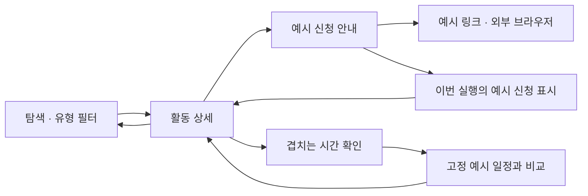

# 모바일 UI 프로토타입

2026-10-03 사용자 승인. iOS·Android에서 현재 디자인과 화면 이동을 파악하기 쉽도록 실제 서비스 실행 로직을 걷어내고 예시 데이터로 동작하게 한다.

## 범위

- 유지 및 추가 반영: selected 폴더의 탐색·상세·신청 상태·프로필·명함·QR·명함함 시각 디자인, 로고·이미지 자산, 필터·뒤로 가기·시트 등 화면 이동. 후속 사용자 승인으로 다섯 탭과 모든 명함 화면을 예시 UI로 다시 포함한다.
- 대체: 활동과 바쁜 시간을 고정 예시로 제공하고 신청 표시 등 화면 상태는 메모리에서만 변경한다. 실제 접수나 캘린더 연동으로 표현하지 않는다.
- 제거: 모바일 API 호출·인증·영구 저장·OS 캘린더·카메라 접근 및 서비스 실행 코드와 의존성. QR 스캔·로그인·명함 보내기·저장은 예시 결과와 메모리 상태로만 이어진다.
- 보존: 서버·웹·어드민·수집 워커·운영 DB, 기기에 이미 있는 앱 저장 데이터. 앱 초기화나 데이터 삭제는 수행하지 않는다.

## 복구

변경 전 main: `82ae19f18c4f10ccfaf3a504f16b63ae07e485ac`.
원격 복구 태그: `backup/mobile-service-before-prototype-20261003`.

이 문서는 프로토타입을 실제 서비스 완료로 간주하지 않는다. 원래 서비스 기능이 필요하면 복구 태그와 서버 계약을 참고해 별도 작업으로 다시 연결한다.

## 공통 예시

| 활동 | 유형 | 표시 상태 | 일정 (서울 시간) |
| --- | --- | --- | --- |
| Dearby 개발자 컨퍼런스 | 참가등록형 | 예시 모집 중 | 2026-10-24 13:00–17:00 |
| Dearby 메이커 캠프 | 선발형 | 예시 모집 중 | 2026-11-07 10:00–18:00 |
| Dearby 커뮤니티 밋업 | 참가등록형 | 예시 모집 예정 | 2026-11-21 14:00–17:00 |

고정 바쁜 시간은 2026-10-24 14:00–15:00이며 실제 사용자 일정이 아니다. 날짜가 지나도 예시 모집 상태는 바뀌지 않는다. 예시 URL은 `https://example.com`이며 실제 신청 사이트가 아니다.

## 디자인 기준

`01a0dd49-8ce1-7263-957a-d63f220da862/selected` 재귀 조사: 현재 흐름 5장, 기타 화면 11장, 로고 2장, 캘린더 후보 4장. 화면 16장과 로고 2장은 기존 `docs/design/approved` 사본과 대응한다. 캘린더는 사용자 직접 지정 [A안](../design/approved/calendar-overlap-a.png)을 적용한다. B/C 및 다른 후보를 섞지 않는다.

최신 범위·시안 대응은 [프로토타입 디자인 적용표](../design/mobile-prototype-reference-map.md)에서 확인한다.

## 진행 상태

iOS·Android 담당이 각각 독립 하위 worktree에서 구현과 검증을 진행 중이다. root가 결과를 검토·통합하고 연결된 실기기에 설치한다. 현재 단계에서 구현·빌드·설치 완료로 기록하지 않는다.
