<!-- .slide: class="cover" -->

# dearby

## 활동 탐색과 명함 교환 서비스

캡스톤디자인 · 현재 구현 현황

2026.10.06

[이전 발표(2026-09-29) 기록본 보기](history/2026-09-29/)

Note:
이 자료는 2026-10-06 기준 현재 제품만 다룬다. 웹 서비스·어드민·수집과 재확인, 진행 중인 작업 순서로 설명한다. 자료구조 선택 과정, 검색 개선안(벡터 색인·양자화), 승인 시안 화면 등 2026-09-29 발표 내용은 기록본(history/2026-09-29)에 그대로 보존했다.
웹·어드민 화면은 실제 실행 캡처이며 각 슬라이드 하단에 운영 화면·테스트 데이터·모의 데이터를 구분해 표시했다.

---
## 문제와 목표

| 문제 | 목표 | 현재 대응 |
| --- | --- | --- |
| 활동 정보가 여러 공식 사이트에 흩어지고 모집 상태가 자주 바뀐다 | 지금 모집 중인 활동만 믿고 본다 | 24시간 안의 공식 확인과 모집 기간으로 노출 판정 |
| 찾은 활동에서 신청까지 가는 길이 길다 | 공식 신청까지 짧게 간다 | 탐색 → 상세 → 공식 신청, 웹 안에서 2번 누름 |
| 행사에서 명함을 만들고 주고받기가 번거롭다 | 명함 교환을 간결하게 한다 | 공유 링크 · 로그인 없는 저장, 앱 바코드 공유는 진행 중 |

**공식 출처를 근거로 보여 주고, 확인되지 않은 정보는 노출하지 않는다.**

Note:
목표 문장은 2026-10-06 조율 기록의 목표("활동 신청이 쉬워야 하고, 네트워킹 때 명함 제작·교환이 간결해야 한다")를 따른다. 탭 수는 docs/research/activity-and-qr-friction-2026-10-06.md의 조사 결과다: 웹에서 탐색 목록 → 활동 상세 → '공식 사이트에서 신청하기'까지 Dearby 화면 안의 누름은 2번이며, 외부 사이트의 신청서 작성·제출은 포함하지 않는다.
Dearby는 신청을 대신 접수하지 않는다. 신청 기록은 사용자의 직접 기록이며 주최 측의 접수 확인과 구분한다.

---
## 현재 서비스 구성과 연결

웹 `dearby.wid.io.kr` · 서버 `api.dearby.wid.io.kr` — 연결은 모두 도메인 주소로 지정한다.

| 구성 | 하는 일 | 2026-10-06 상태 |
| --- | --- | --- |
| 사용자 웹 | 활동 탐색 · 공유 명함 · 로그인 없는 저장 | 운영 중 |
| 서버 | 활동 목록 · 공개 명함 · 게스트 세션1 | 운영 중 |
| 어드민 | 조직·활동 편집 · 공식 확인 · 수집 관리 | 구현 · 운영 반영 대기 |
| 수집 실행기 | 매일 수집 · 게시 활동 자동 재확인 | 실행 중 · 재확인 배포 대기 |
| 모바일 앱 | 실제 활동 목록 · 로그인 · 명함 발행 | 바코드 공유·받기 진행 중 |

**탐색 노출 = 게시 + 24시간 안의 공식 확인 + 모집 기간 안**

1 게스트 세션: 로그인하지 않은 방문자의 저장 목록을 서버가 구분하는 기록. 브라우저는 그 식별값만 보관한다.

Note:
모든 연결은 도메인 기반이다. 웹 서버와 모바일 빌드는 서버 주소를 설정값으로 받으며 운영 값은 저장소가 아닌 배포 환경 설정에만 둔다. 웹은 브라우저에서 서버를 직접 부르지 않고 웹 서버의 고정된 허용 경로로만 전달한다.
탐색 노출 조건은 서버·웹·어드민이 같은 규칙을 쓴다: 게시 상태, 공식 확인 후 24시간 이내, 모집 기간 안(시작 전·마감 후 제외), 관리자가 조기 마감으로 지정하지 않음. 2026-10-06 캡처 시점 운영 웹의 공개 활동은 1건이었다. 빈 화면을 채우려고 예시 활동을 넣지 않는다.
상태 열은 2026-10-06 조율 기록(docs/context/coordinator-current-task-and-decisions.md, 기본 브랜치) 기준이다. 어드민의 모집 기간 판정·자동 재확인 표시·수집 차단 구분, 조직 계층, 재확인 실행기는 기본 브랜치에 병합됐고 운영 반영 순서가 남아 있다. 모바일은 실제 활동 목록(#116)·로그인(#122)·명함 발행(#133)이 병합됐고 이차원 바코드 공유는 변경 제안 검토 중(#147)이다.

---
<!-- .slide: class="screens triple" data-status="운영 웹 실제 화면 · 2026-10-06 캡처 · 당시 공개 활동 1건" -->

## 웹 · 모집 중인 활동에서 공식 신청까지

참여 방식으로 거르고, 상세에서 모집 상태·공식 출처·확인 시각을 본 뒤 공식 사이트에서 신청한다.

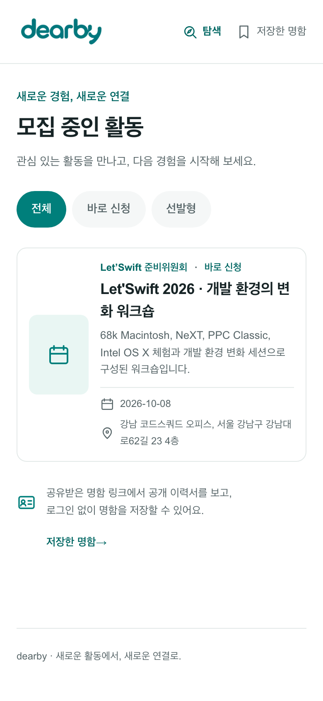
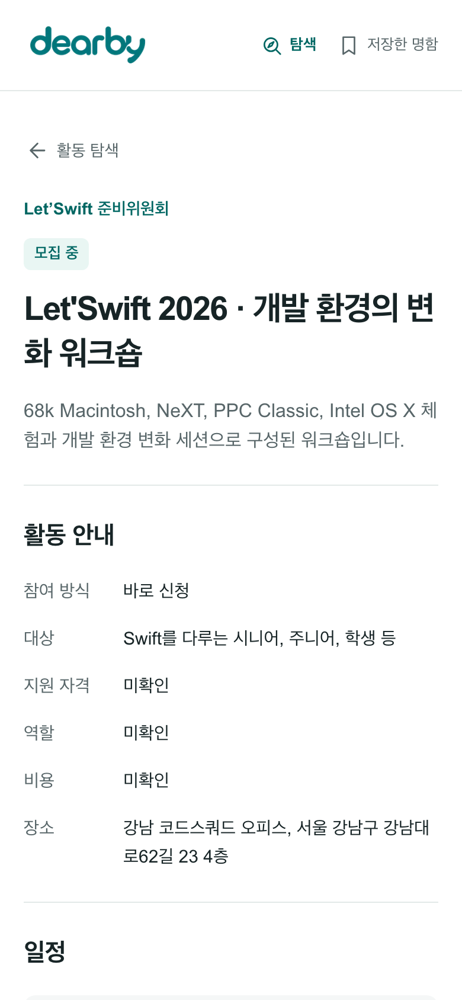
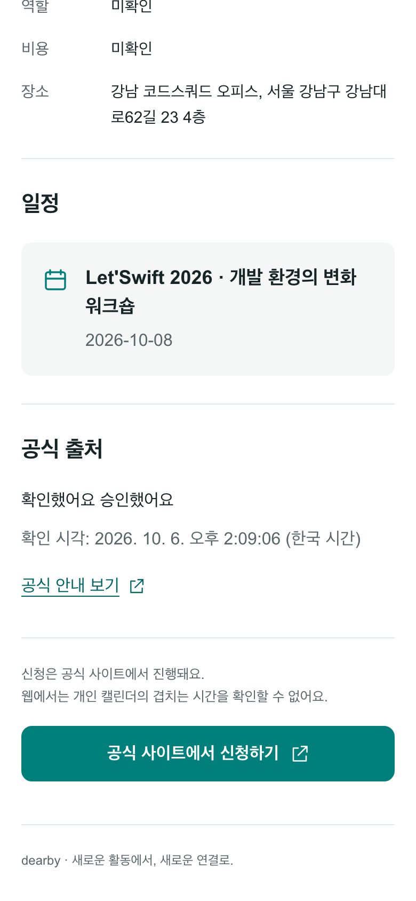

Note:
https://dearby.wid.io.kr 에서 2026-10-06 휴대전화 폭(390픽셀)으로 캡처했다. 저장·신청 버튼은 누르지 않았다.
탐색은 모집 중이며 확인이 유효한 활동만 보여 주고 전체·바로 신청·선발형으로 거른다. 불러오기 실패와 빈 목록은 서로 다른 화면으로 보여 주며 다시 시도할 수 있다. 상세의 신청 버튼은 모집 중이고 안전한 공식 신청 주소가 있을 때만 보이며, 링크를 여는 것을 신청 완료로 기록하지 않는다. 웹은 개인 캘린더를 읽지 않는다는 점을 화면에 밝힌다.
캡처에서 발견한 점: 상세의 '공식 출처' 문구에 관리자가 입력한 확인 메모가 그대로 노출된다. 방문자용 출처 설명으로 정리할 필요가 있다.
근거: apps/web/src/components/discovery.tsx, activity-detail.tsx, src/lib/models.ts (기본 브랜치).

---
<!-- .slide: class="screens triple" data-status="로컬 실행 · 저장소의 테스트용 서버 대역 데이터 (실제 사용자 아님)" -->

## 웹 · 공유 명함과 로그인 없는 저장

공유 링크 `/s/…`에서 명함과 보낸 사람이 고른 활동을 보고, 버튼 하나로 이 브라우저에 저장한다.

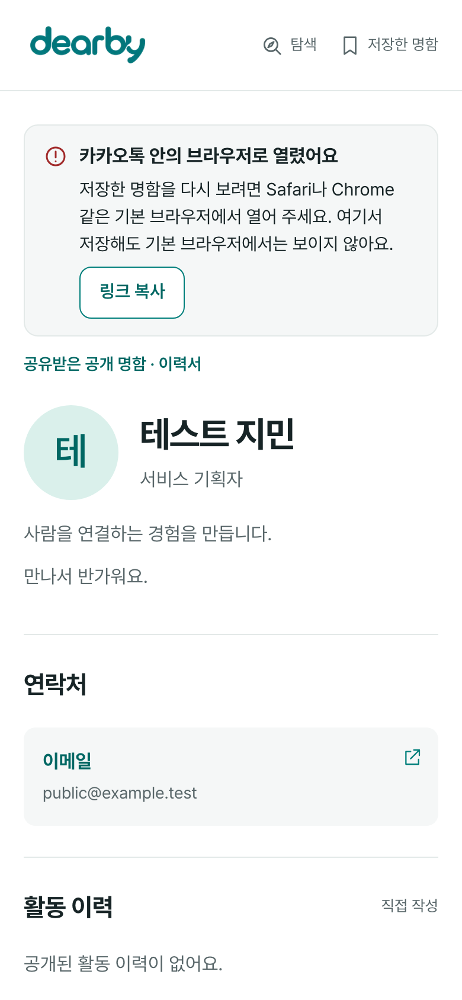
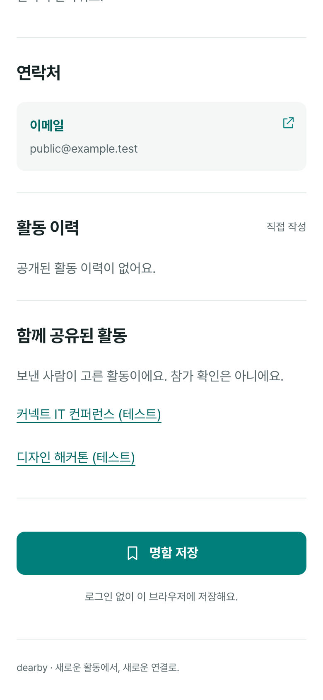
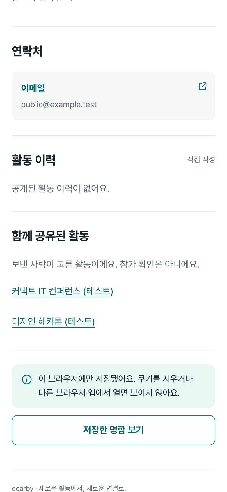

Note:
운영에 공유 기록이나 저장 세션을 만들지 않기 위해 기본 브랜치의 웹을 로컬에서 실행하고 저장소에 포함된 테스트용 서버 대역(tests/fixture-api.ts)에 연결해 캡처했다. 이름·연락처·활동은 모두 테스트 데이터다.
'함께 공유된 활동'은 보낸 사람이 고른 활동이며 참가 확인이 아니다. 저장은 공유 저장 요청이 성공한 뒤 저장 목록을 다시 읽어 쿠키가 실제로 남았는지 확인하고 나서 완료로 표시한다. 취소된 공유나 잘못된 주소는 '명함을 볼 수 없어요' 화면으로 안내한다.
카카오톡 등 알려진 앱 안 브라우저는 사용자 에이전트 문자열로 추정해 기본 브라우저로 열도록 안내한다. 추정이 틀릴 수 있어 저장 자체는 막지 않는다. 공개 명함은 /cards/:id에서도 볼 수 있다.
근거: apps/web/src/components/share-page.tsx, widgets/card/shared-card.tsx, tests/e2e/share-page.spec.ts.

---
## 웹 · 로그인 없이 저장을 이어 가는 방법

| 상황 | 처리 |
| --- | --- |
| 처음 저장 | 서버가 게스트 세션을 만들고 브라우저에는 식별 쿠키1만 둔다 |
| 다시 방문 | 서버 세션은 만료 없음 · 쿠키 기간(최대 400일)은 방문마다 갱신 |
| 홈 화면에 추가 | 설치 정보 파일2 제공 · 첫 화면은 저장한 명함 |
| iOS 홈 화면 앱 | Safari와 쿠키가 분리되어 1회용 코드(10분)로 같은 세션을 잇는다 |
| 앱 설치 사용자 | `/s/` 링크를 앱으로 여는 연결 파일3 · iOS 제공, Android 대기 |

**저장 목록은 이 브라우저의 세션에만 있고 다른 기기와 동기화하지 않는다.**

1 쿠키: 사이트가 브라우저에 맡겨 두는 작은 값. 여기서는 세션 식별값만 담고 페이지의 스크립트가 읽지 못하게 설정한다.

2 설치 정보 파일: 이름·아이콘·시작 주소를 담아 웹을 홈 화면 앱처럼 설치하게 하는 웹 앱 매니페스트.

3 앱 연결 파일: 웹 주소를 설치된 앱으로 열어도 되는지 운영체제가 확인하는 파일(유니버설 링크·앱 링크).

Note:
iOS 26.5 시뮬레이터에서 홈 화면 앱이 처음 열릴 때 쿠키가 비어 있고 이후에도 Safari와 분리된다는 것을 확인했다. 그래서 설치 정보 파일을 요청마다 만들고, 저장한 명함이 있는 브라우저에는 시작 주소에 1회용 코드를 붙인다. 홈 화면 앱은 처음 열릴 때 이 코드를 교환해 같은 세션 쿠키를 받고, 코드 없이 저장 목록으로 이동한다. 코드는 10분·1회용이며 웹은 코드를 기록하지 않는다. 시험용 서버 대역으로 시뮬레이터에서 확인했으며 실제 기기는 아직 확인하지 않았다. 서비스 워커를 두지 않아 저장한 명함을 기기에 캐시하지 않는다.
운영 확인(2026-10-06): 설치 정보 파일은 캐시 금지·쿠키별 응답으로 제공되고, iOS 앱 연결 파일은 응답하며, Android 연결 파일은 앱 서명값이 정해지지 않아 404다.
설치 안내 화면과 '활동별' 저장 목록 묶음은 공통 부품과 규칙까지 구현했고 화면 연결은 진행 중이다. 현재 /saved는 저장 순 목록과 세션 삭제를 제공한다.
근거: apps/web/README.md, src/app/manifest.webmanifest/route.ts, src/proxy.ts, src/app/.well-known, shared/contracts/native-v1.md '비로그인 사용자의 저장 유지'.

---
<!-- .slide: class="screens wide single" data-status="어드민 로컬 실행 · 모의 데이터 화면 (실제 서버 미연결)" -->

## 어드민 · 조직 트리에서 바로 고치기

조직 → 하위 조직(최대 4단계) → 프로그램 → 활동을 펼쳐 보고, 이름·소개·상위 조직을 행에서 수정한다.

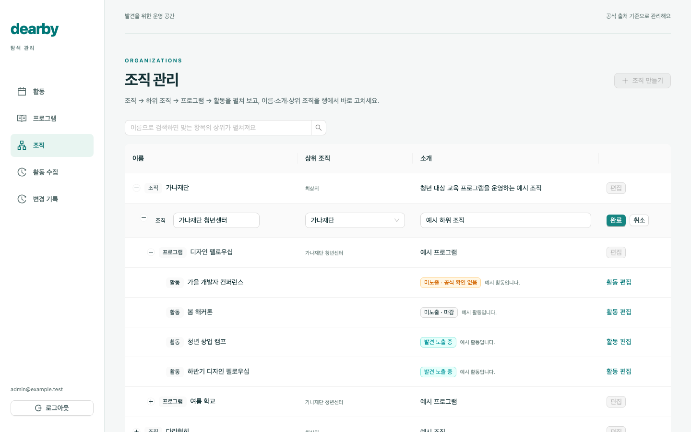

Note:
기본 브랜치의 어드민(Vite·React·Ant Design)을 로컬에서 빌드하고, 저장소의 브라우저 검사와 같은 방식으로 가짜 관리자 세션과 가로챈 응답을 넣어 캡처했다. 조직·프로그램·활동 이름은 모두 예시다. 운영 계정으로 로그인하지 않았다.
자기 자신이나 하위 조직을 상위 조직으로 지정할 수 없고, 펼친 행의 하위 항목만 불러온다. 검색하면 맞는 항목의 상위가 펼쳐진다. 계층 데이터베이스 변경이 적용되기 전에는 평면 목록으로 보이고 상위 조직 값을 보내지 않는다. 수집 설정이 있는 프로그램 편집은 별도 프로그램 화면에서 한다.
근거: apps/admin/src/organization-tree.tsx, tests/browser/organizations*.spec.ts.

---
<!-- .slide: class="screens wide single" data-status="어드민 로컬 실행 · 모의 데이터 화면 (실제 서버 미연결)" -->

## 어드민 · 게시와 탐색 노출을 나누어 표시

초안 → 공식 확인 기록 → 게시 순서로 공개한다. 게시해도 확인 기간과 모집 기간을 충족해야 탐색에 보인다.

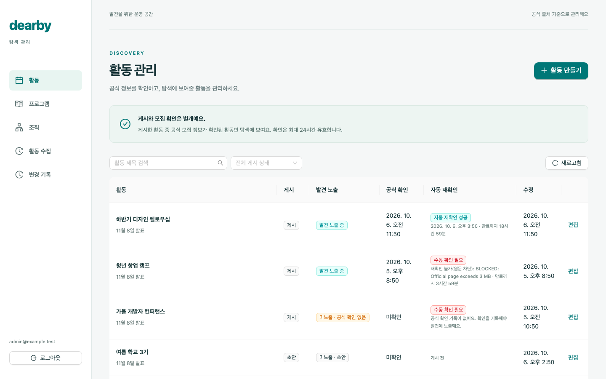

Note:
'발견 노출' 열은 탐색 노출 조건을 그대로 계산해 '발견 노출 중' 또는 '미노출 · 초안/숨김/마감/공식 확인 없음/공식 확인 만료'로 보여 준다. '자동 재확인' 열은 성공·대기·수동 확인 필요와 그 이유, 확인 만료까지 남은 시간을 보여 준다.
숨김은 공개 목록에서 제외하며 기본 어드민은 물리 삭제를 제공하지 않는다. 활동 본문·일정·주소·모집 상태를 고치면 기존 공식 확인이 해제된다. 변경 기록은 데이터베이스가 자동으로 남기며 관리자 권한은 행 수준 보안 정책으로 데이터베이스에서 검사한다.
근거: apps/admin/src/activities.tsx, src/catalog.ts(discoveryStatus·recheckState), tests/browser/activity-reverify.spec.ts.

---
<!-- .slide: class="screens wide" data-status="어드민 로컬 실행 · 모의 데이터 화면 (실제 서버 미연결)" -->

## 어드민 · 모집 기간과 공식 확인 기록

모집 상태는 시작·마감 시각으로 판정하고, 확인 기록에 남긴 원문 구절은 자동 재확인의 기준이 된다.

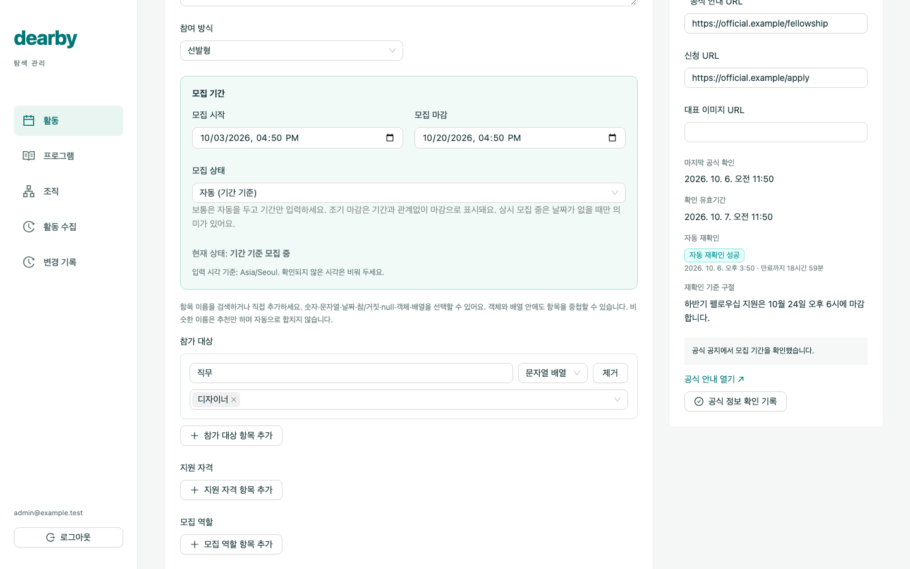
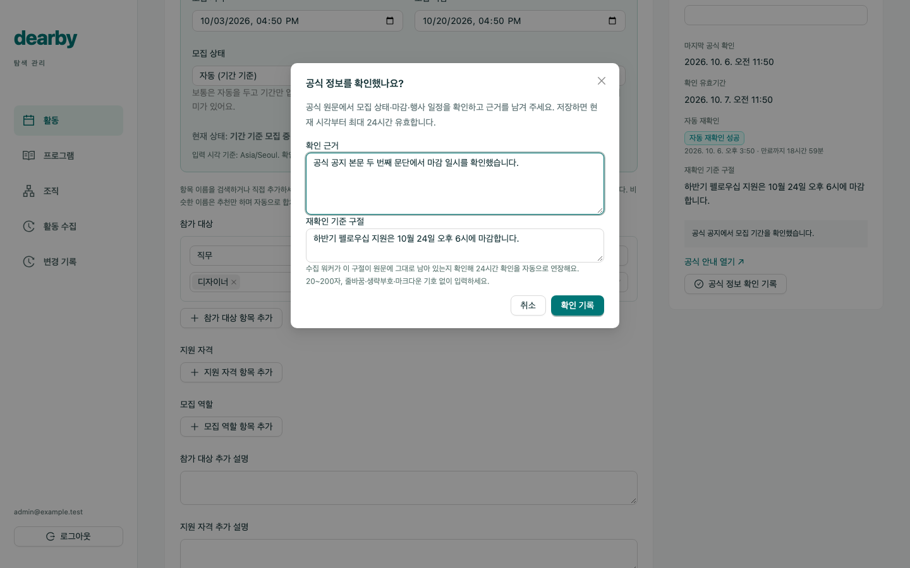

Note:
모집 상태 기본값은 '자동(기간 기준)'이다. 관리자가 고른 조기 마감이 가장 우선하고, 다음으로 시작·마감 시각이 모집 예정·모집 중·마감을 정한다. 날짜가 없을 때만 '상시 모집 중' 선택이 의미가 있다. 저장 전에 현재 상태를 미리 보여 준다(#128, 서버 판정 #129와 같은 규칙).
공식 정보 확인 기록은 관리자가 원문을 직접 읽고 근거를 10자 이상 남기는 절차이며 버튼이 원문을 자동 검사하지 않는다. 재확인 기준 구절은 원문 그대로 20~200자 한 구절이어야 하고 줄바꿈·생략부호·마크다운 기호를 거부한다. 비워 두면 자동 재확인 대상이 아니어서 24시간마다 직접 다시 확인해야 한다.
근거: apps/admin/src/activities.tsx, src/catalog.ts(inferredRecruitment·evidenceQuoteError).

---
<!-- .slide: class="screens wide single" data-status="어드민 로컬 실행 · 모의 데이터 화면 (실제 서버 미연결)" -->

## 어드민 · 수집 실패의 원인과 조치 구분

구독 문제는 전체 수집을 멈추고, 원문·설정 문제는 해당 프로그램만 멈춘다. 원인을 고친 뒤 재시도한다.

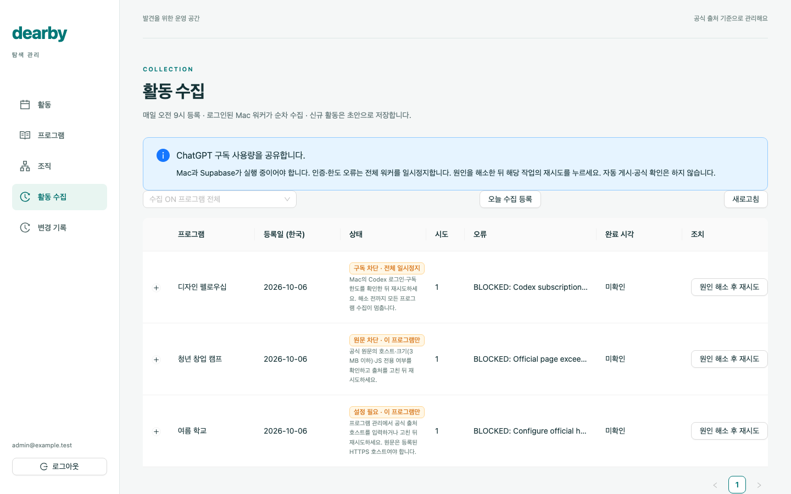

Note:
수집 작업의 차단 상태는 하나지만 실행기가 남긴 오류 문구로 원인을 나눈다. 구독 차단(로그인·사용 한도, 전체 일시정지), 원문 차단(주소·3메가바이트 크기·자바스크립트 전용 페이지), 설정 필요(공식 출처 주소 미등록·불일치)이며, 그 밖의 경우는 '조치 필요'로 표시한다. 재시도는 전역 구독 일시정지도 해제한다. 수집 결과는 초안·변경 제안으로만 저장하며 자동으로 게시하거나 공식 확인하지 않는다.
같은 구분을 활동 목록의 자동 재확인 실패 이유에도 쓴다(예: '재확인 불가(원문 차단)').
근거: apps/admin/src/collection.tsx, src/catalog.ts(collectionBlock), tests/browser/collection-blocks.spec.ts (#120).

---
<!-- .slide: class="pipeline" -->

## 프로그램별 매일 활동 수집1

### 예약 실행 → 작업 대기열 → 수집 실행기 → 검토 결과

1. **예약** — 매일 한국 시각 오전 9시에 프로그램별 작업을 등록한다.
2. **검색** — Mac의 수집 실행기가 구독 로그인된 `codex exec`를 순차 실행한다.
3. **확인** — 공식 출처의 주소·본문과 후보 활동을 대조한다.
4. **반영** — 신규 초안과 기존 활동의 변경 제안을 저장한다.

**운영 데이터베이스 대상 실행 중** — 로그인된 Mac이 1분마다 작업을 확인한다. 반복 실패를 줄이는 개선은 기본 브랜치에 반영했고 운영 재배포를 기다린다.

1 작업 대기열: 실행할 일을 저장하고 차례로 꺼내는 구조. 수집 실행기는 이 일을 실제로 처리하는 프로그램.

Note:
예약은 데이터베이스의 예약 실행 기능이 맡고, 실제 검색은 Mac의 사용자 예약 실행기가 1분 간격으로 한 작업씩 처리한다. 결과는 클라우드 데이터베이스에 저장한다. 모델은 gpt-6-luna이며 ChatGPT 구독 로그인 경로를 쓰고, 별도 사용량 과금 경로로 자동 전환하지 않는다. Mac 전원·로그인·네트워크가 필요하다. 구독 인증·한도 오류가 나면 전체 수집을 일시정지하고 관리자가 원인을 고친 뒤 재시도한다.
운영 기록에서 같은 프로그램이 원문 본문 없음(자바스크립트로만 그리는 페이지로 추정)·크기 초과·허용 주소 불일치로 매일 반복 실패하는 양상을 확인했다. 그래서 구조적 실패는 당일 재시도하지 않고(#118), 원문 크기 한도를 3메가바이트로 늘렸으며(#121), 기록에 시각을 붙였다(#115). 이 개선은 기본 브랜치에 병합됐고 운영 재배포가 남아 있다(2026-10-06 조율 기록 기준). 장기 운영 지표는 아직 정리하지 않았다.
근거: 기본 브랜치 apps/catalog-worker, docs/context/catalog-subscription-worker-handoff.md. 예약 기능: https://supabase.com/docs/guides/cron

---
## 수집 결과의 정제와 자동 재확인1

| 단계 | 처리 원칙 |
| --- | --- |
| 출처 확인 | 허용한 공식 사이트의 원문과 증거 구절 보존 |
| 형식 통일 | 날짜·주소·값의 종류를 검증하고 모르는 값은 비워 둠 |
| 중복 검토 | 프로그램·공식 주소·회차를 기준으로 같은 활동인지 판단 |
| 변경 보호 | 관리자 수정·게시된 내용은 변경 제안으로 검토 |
| 실패 처리 | 오류·재시도·검토 대기 상태를 기록 |
| 자동 재확인 | 게시 활동의 기준 구절이 원문에 그대로 있으면 확인을 24시간 연장 |

**자동 수집 결과를 곧바로 공식 확인·게시하지 않는다.**

1 정제: 수집값의 형식·중복·누락·오류를 점검해 저장 가능한 형태로 다듬는 과정.

Note:
원문에 짧은 증거 구절이 있다는 사실만으로 날짜나 모집 조건의 모든 필드가 검증되지는 않는다. 종료 시각이나 마감 시각을 추정해서 채우지 않고, 원문 부재를 곧바로 모집 종료로 간주하지 않는다. 출처 접근 실패는 실패로 기록한다.
자동 재확인은 인공지능 모델을 쓰지 않는다. 하루 한 번 공식 페이지를 받아 관리자가 등록한 기준 구절이 그대로 있는지만 비교한다(#123·#124). 구절이 없거나 원문을 받을 수 없으면 연장하지 않고 어드민에 '수동 확인 필요'로 표시한다. 재확인 실행기는 기본 브랜치에 병합됐고 운영 재배포를 기다린다.
근거: 기본 브랜치 apps/catalog-worker, shared/contracts/catalog-v1.md, 2026-10-06 조율 기록.

---
## 진행 중인 작업

| 영역 | 내용 | 상태 |
| --- | --- | --- |
| 모바일 바코드 공유 | 현재 명함으로 공유 링크를 만들어 이차원 바코드로 표시 | 변경 제안 검토 중 |
| 모바일 받기 | 앱 안 스캐너·링크로 공유 명함을 열고 계정에 저장 | 서버 병합 · 앱 연결 중 |
| 신청 확인 안내 | 공식 신청 후 앱으로 돌아오면 신청 여부를 한 번 묻기 | 계약 확정 · 구현 중 |
| 기기 캘린더 겹침 | 활동 일정과 기기 일정의 겹침을 기기 안에서만 계산 | 계약 확정 · 구현 중 |
| 웹 저장 목록 | 활동별 묶음 · 홈 화면 설치 안내 화면 | 부품 구현 · 화면 연결 중 |
| 운영 반영 | 어드민 최신 기능 · 재확인 실행기 · 조직 계층 | 배포 순서 진행 중 |

**예시 화면이나 계약만 있는 기능은 완료로 표시하지 않는다.**

Note:
모바일 이차원 바코드 공유: https://github.com/fixabley/dearby/pull/147 (2026-10-06 열린 상태). 받은 공유를 로그인 계정에 저장하는 서버 기능은 #141·#142·#143으로 병합됐다.
신청 확인 안내와 기기 캘린더 겹침은 #148 계약으로 확정했다. 캘린더는 겹치는 시간 확인을 누를 때만 권한을 요청하고 일정 제목·시각을 서버로 보내거나 저장하지 않는다. 신청 표시는 사용자 직접 기록이며 주최 측 접수 확인이 아니다.
운영 반영 순서는 2026-10-06 조율 기록의 '남은 일'을 따른다.

---
## 정리와 다음 단계

| 구분 | 내용 |
| --- | --- |
| 동작 중 | 운영 웹(탐색·공식 신청·공유 명함·로그인 없는 저장) · 서버 · 매일 수집 |
| 반영 대기 | 어드민 최신 기능 · 자동 재확인 실행기 · 조직 계층 |
| 다음 작업 | 모바일 바코드 공유·받기 · 반복 실패 출처 보완 · 노출 활동 수와 수집 성공률 측정 |

자료구조 선택 과정, 검색 개선안, 승인 시안 화면은 [2026-09-29 발표 기록본](history/2026-09-29/)에 보존했다.

Note:
반복 실패 출처 보완과 상시 실행 조건은 https://github.com/fixabley/dearby/issues/57 에서 추적한다. 운영 반영 순서는 2026-10-06 조율 기록의 '남은 일'을 따른다. 모바일 바코드 공유는 https://github.com/fixabley/dearby/pull/147 에서 검토 중이다.
2026-10-06 캡처 시점 운영 웹의 공개 활동은 1건이다. 노출 활동 수를 늘리려면 수집 성공률과 공식 확인 처리량을 함께 개선해야 하며, 예시 활동을 넣어 화면을 채우지 않는다.
