<!-- .slide: class="cover" -->

# dearby

## 활동 탐색의 데이터와 경험

캡스톤디자인 · 개발 경과 및 개선 방안

2026.09.29

Note:
이번 발표는 자료구조 선택, 주기적 수집과 정제, 검색 방법과 개선 방향, 승인한 화면 순서로 설명한다. 기술 구현 상태는 2026-09-29 기준이다. 자바스크립트 객체 표기법 조건 편집·검색 기반은 구현됐으며 주기 수집 실행기는 별도 브랜치에서 로컬 정기 실행과 실검색 저장을 검증했으며 통합 검토 중이다. 화면 이미지는 selected에 모은 승인 시안이며 실제 앱 실행 캡처와 구분한다.

---
<!-- .slide: class="structure" -->

## 자료구조: 관계형 테이블과 유연한 문서

### 조직 → 프로그램 → 활동 → 일정

조직과 프로그램의 정체성은 **외래 키**<sup>1</sup>로 연결하고,<br>활동마다 달라지는 참가 조건은 **이진 구조화 문서**<sup>2</sup>에 저장한다.

| 관계형 컬럼 | 문서에 담는 조건 |
| --- | --- |
| 이름 · 공식 주소 · 모집 상태 · 일정 | 참가 대상 · 지원 자격 · 모집 역할 |
| 일관된 연결과 제약 조건 | 숫자 · 문자열 · 배열 · 중첩 객체 |
| 조회·정렬이 반복되는 공통 정보 | 프로그램별로 달라지는 정보 |

<div class="footnotes" role="note" aria-label="용어 설명">
<p><sup>1</sup> 외래 키: 다른 테이블의 식별자를 참조해 조직·프로그램·활동의 관계를 유지하는 열.</p>
<p><sup>2</sup> 이진 구조화 문서: 항목 이름과 값을 담는 자바스크립트 객체 표기법을 데이터베이스가 처리하기 좋은 형태로 저장한 문서.</p>
</div>

Note:
Supabase는 PostgreSQL 기반이다. catalog_organizations, catalog_programs, catalog_activities, catalog_schedules가 공통 구조를 담당하고 catalog_activities.criteria가 세 가지 조건 범주를 담는다. 모든 조건을 문자열로 저장하면 숫자 비교가 어려워지고, 모든 키를 고정 컬럼으로 만들면 프로그램마다 스키마 변경이 필요해 혼합 구조를 선택했다.
근거: shared/contracts/catalog-v1.md, supabase/migrations, apps/admin/README.md.

---
<!-- .slide: class="code-slide" -->

## 조건을 자료형이 있는 값으로 저장<sup>1</sup>

```json
{
  "audience": { "직무": ["개발자", "디자이너"] },
  "qualification": {
    "연차": 3,
    "경력": { "부터": 3, "까지": 4 },
    "기준일": "2026-10-01",
    "재직": true,
    "추가 조건": null
  },
  "roles": { "기술": { "언어": ["TypeScript"] } }
}
```

숫자 하나와 범위 객체를 모두 허용하고, 객체 안에 다시 객체를 넣는다.

**날짜는 연도-월-일 문자열**로 저장한다. 이 문서 형식에는 날짜 전용 자료형이 없다.

<div class="footnotes" role="note" aria-label="용어 설명">
<p><sup>1</sup> 자료형: 숫자·문자열·참과 거짓 등 값의 종류. 객체는 키와 값의 묶음이며, 중첩은 그 안에 다시 객체를 넣는 구조.</p>
</div>

Note:
위 내용은 실제 데이터가 아닌 입력 구조 예시다. 관리자 편집기에서 숫자·문자열·날짜·불리언·null·객체·배열을 선택한다. 날짜 선택 사용자 화면가 있어도 저장값은 문자열이다. 연차 3은 자동으로 3년 이상/이하를 뜻하지 않는다. 의미와 단위는 필드 규칙으로 정해야 한다. 현재 범위 표시기는 숫자인 '부터'와 '까지'가 있으면 닫힌 범위로 표현한다.
근거: apps/admin의 조건 편집기 및 catalog-v1 계약. https://www.postgresql.org/docs/current/datatype-json.html

---

## 자유 입력에 유사 키 자동완성 추가

### `경력`을 입력할 때, 이미 쓰인 키를 먼저 제안

- 같은 조건 범주와 상위 경로에서 기존 키를 찾는다.
- 부분 일치와 **문자열 유사도**<sup>1</sup>로 후보를 제안한다.
- 원하는 항목이 없으면 새 키와 값을 직접 입력한다.
- 중복 키·과도한 중첩·잘못된 값은 저장 전에 검증한다.

> 자유도를 유지하면서 `경력`, `경력 연차`처럼 이름이 흩어지는 일을 줄인다.

<div class="footnotes" role="note" aria-label="용어 설명">
<p><sup>1</sup> 문자열 유사도: 글자 조각의 겹침으로 이름의 닮은 정도를 계산한 값. 문장의 의미가 같은지를 판정하는 값은 아님.</p>
</div>

Note:
구현 완료: 타입별 입력, 중첩 자바스크립트 객체 표기법, 기존 키 및 문자열 값 제안. pg_trgm 기반 문자열 유사도이며 임베딩을 쓰는 의미 검색은 아니다. 유사 키를 자동으로 합치지 않는다. 객체 깊이 8, 전체 자바스크립트 객체 표기법 64킬로바이트 등 저장 한도가 있다. 같은 객체의 키는 유니코드 정규 결합 형식·공백·대소문자 정규화 기준 중복을 차단한다. 동의어 사전과 공통 단위는 추후 과제다.
근거: 93de583, supabase/migrations 및 apps/admin 조건 편집기.

---
<!-- .slide: class="pipeline" -->

## 프로그램별 주기적 활동 수집<sup>1</sup>

### 예약 실행 → 작업 대기열 → 수집 실행기 → 검토 결과

1. **예약** — 매일 한국 시각 오전 9시에 프로그램별 작업을 등록한다.
2. **검색** — 로컬 수집 실행기가 구독 로그인된 `codex exec`를 순차 실행한다.
3. **확인** — 공식 출처의 주소·본문과 후보 활동을 대조한다.
4. **반영** — 신규 초안과 기존 활동의 변경 제안을 저장한다.

**로컬 실행 검증 완료** · 28개 작업 등록·실검색 초안 저장 확인<br>별도 브랜치에서 통합 검토 중이며, 장기 연속 운영은 아직 검증하지 않았다.

<div class="footnotes" role="note" aria-label="용어 설명">
<p><sup>1</sup> 작업 대기열: 실행할 일을 저장하고 차례로 꺼내는 구조. 수집 실행기는 이 일을 실제로 처리하는 프로그램.</p>
</div>

Note:
Supabase 예약 실행과 로컬 Mac 수집 실행기를 분리했다. 2026-09-29 완료 보고 및 원격 변경 제안의 최신 커밋 8302f2b를 확인했다. 매일 한국 표준시 오전 9시 예약이 활성화됐고, 당일 28개 프로그램 작업이 등록됐다. 등록은 28개 모두 수집 성공했다는 뜻이 아니다. 운영체제의 사용자 예약 실행기가 60초 간격으로 한 작업씩 처리한다. 드로이드나이츠에서 원문 구절을 확인한 초안 1개 저장을 인계 문서에서 확인했고, 후속 완료 보고에는 삼성 인공지능 포럼 초안 3개 저장도 포함된다.
모델은 gpt-6-luna이며 ChatGPT 구독 로그인 경로를 유지한다. 별도 사용량 과금 경로로 자동 전환하지 않는다. Mac 전원·로그인·네트워크와 로컬 데이터베이스가 필요하다. 다음 날 예약 시각의 실제 실행과 장기 무중단 운영까지 검증한 것은 아니다. 기본 브랜치에는 아직 통합되지 않았다.
검증 근거: https://github.com/fixabley/dearby/pull/58 (초안 변경 제안, head 8302f2b). 수집·관리자 및 서버 자동 검사는 성공을 확인했다. 별도 브랜치의 docs/context/catalog-subscription-worker-handoff.md 완료 보고를 함께 확인했다.
예약 기능: https://supabase.com/docs/guides/cron

---

## 수집 결과의 정제와 최신화<sup>1</sup>

| 단계 | 처리 원칙 |
| --- | --- |
| 출처 확인 | 허용한 공식 사이트의 원문과 증거 구절 보존 |
| 형식 통일 | 날짜·주소·값의 종류을 검증하고 모르는 값은 비워 둠 |
| 중복 검토 | 프로그램·공식 주소·회차를 기준으로 같은 활동인지 판단 |
| 변경 보호 | 관리자 수정·게시된 내용은 변경 제안으로 검토 |
| 실패 처리 | 오류·재시도·검토 대기 상태를 기록 |

**자동 수집 결과를 곧바로 공식 확인·게시하지 않는다.**

<div class="footnotes" role="note" aria-label="용어 설명">
<p><sup>1</sup> 정제: 수집값의 형식·중복·누락·오류를 점검해 저장 가능한 형태로 다듬는 과정.</p>
</div>

Note:
이 표의 반영 규칙은 별도 수집 브랜치에서 구현·검증했다. 작업 대기열 검사 11개, 수집 실행기 검사 12개, 데이터베이스·서버 통신 회귀 검사 8개, 브라우저 검사 3개가 포함된 관리자 자동 검사 성공을 확인했다. 원문에 짧은 증거 구절이 존재한다는 사실만으로 날짜나 모집 조건의 모든 필드가 검증되지는 않는다. 회차 구분, 작업 점유 만료·재시도, 관리자 수정 보존은 관련 검사로 확인했다. 개별 후보의 모든 필드가 사실과 일치한다는 보증은 아니며, 출처 접근 실패는 실패로 기록한다. 종료 시각이나 마감 시각을 추정해서 채우지 않는다. 원문 부재를 곧바로 모집 종료로 간주하지 않는다.
근거: https://github.com/fixabley/dearby/pull/58 의 수집 브랜치 완료 인계 문서.

---

## 현재 검색: 텍스트와 구조화 조건

| 목적 | 현재 지원 범위 |
| --- | --- |
| 활동 찾기 | 관리자에서 활동 제목의 포함 검색 |
| 입력 도움 | 기존 키·문자열 값 자동완성 |
| 구조화 문서 조회 | 범용 역색인<sup>1</sup>으로 포함·키 조회 지원 |
| 앱 표시 | 구조화 조건을 서버가 제공하는 설명 형식으로 변환 |

**숫자 범위·날짜 정렬은 별도 설계가 필요하다.**<br>자주 쓰는 경로에 표현식 색인<sup>2</sup>을 두거나 공통 열로 옮긴다.

<div class="footnotes" role="note" aria-label="용어 설명">
<p><sup>1</sup> 범용 역색인: 문서의 키·값에서 해당 문서 목록을 찾는 검색 구조. 숫자 범위와 정렬을 모두 해결하지는 않음.</p>
<p><sup>2</sup> 표현식 색인: 문서에서 꺼내거나 계산한 특정 값에 만들어, 같은 계산을 사용하는 조회를 돕는 검색 구조.</p>
</div>

Note:
범용 역색인은 구조화 문서의 포함 연산과 항목 이름의 존재 조회 등에 적합하다. 임의 숫자 범위와 정렬에는 별도 색인이 필요하다. 현재 앱 서버에 임의 문서 조건 검색이나 자동 지원자격 판정이 구현된 것은 아니다. pg_trgm 유사도 함수 사용만으로 자동으로 trigram 인덱스를 사용하는 것도 아니다. 성능 수치는 아직 벤치마크하지 않았다.
근거: shared/contracts/catalog-v1.md. https://www.postgresql.org/docs/current/datatype-json.html#JSON-INDEXING

---

## 개선 방향: 조건 필터 + 의미 검색

### “주말에 참여할 수 있는 개발자 네트워킹”

1. **조건 필터** — 모집 상태·일정·참가 대상처럼 명확한 조건을 적용
2. **의미 검색** — 소개·활동 내용의 임베딩<sup>1</sup>으로 유사한 후보를 탐색
3. **재정렬** — 관련도·최신성·출처 품질을 함께 평가

> 지원 자격 충족 여부는 규칙으로 확인하고,<br>벡터 유사도<sup>2</sup>는 관심사와 내용의 관련도를 찾는 데 사용한다.

**추후 도입안** · 현재 임베딩·벡터 검색은 적용하지 않았다.

<div class="footnotes" role="note" aria-label="용어 설명">
<p><sup>1</sup> 임베딩: 글의 특징을 여러 숫자로 표현하는 과정 또는 그 결과.</p>
<p><sup>2</sup> 벡터 유사도: 숫자들의 묶음 사이 거리나 방향을 비교해 관련성을 추정하는 값.</p>
</div>

Note:
벡터 검색은 숫자나 날짜 규칙을 대체하지 않는다. 임베딩 생성·갱신 비용도 발생한다. 근사 최근접 이웃 탐색 인덱스와 메타데이터 필터를 함께 쓰면 구현 방식에 따라 결과 수가 부족해질 수 있어 재현율과 필터 적용을 함께 평가해야 한다. pgvector는 PostgreSQL 안에서 정확 탐색 및 계층적 탐색 가능한 작은 세계 그래프·역파일 기반 원본 벡터 탐색을 지원한다.
출처: https://github.com/pgvector/pgvector#filtering

---

## 벡터 색인: 군집과 계층 그래프 비교

| | 군집 기반 탐색<sup>1</sup> | 계층 그래프 탐색<sup>2</sup> |
| --- | --- | --- |
| 구조 | 벡터를 군집으로 나누어 저장 | 가까운 벡터를 다층 그래프로 연결 |
| 탐색 | 가까운 군집부터 후보 비교 | 상위층에서 이동한 뒤 하위층 정밀 탐색 |
| 조절 | 조사할 군집 수 | 탐색 후보 수·그래프 연결 수 |
| 비용 | 군집 학습과 분포 변화 고려 | 메모리·구축 비용 고려 |

후보를 더 탐색하면 대체로 **재현율<sup>3</sup>은 높아지고 지연은 증가**한다.

<div class="footnotes" role="note" aria-label="용어 설명">
<p><sup>1</sup> 군집 기반 탐색: 비슷한 벡터를 묶고 가까운 군집부터 비교하는 역파일 기반 방식.</p>
<p><sup>2</sup> 계층 그래프 탐색: 가까운 벡터를 여러 층으로 연결한 작은 세계 그래프를 따라 후보를 찾는 방식.</p>
<p><sup>3</sup> 재현율: 정확 검색이 찾은 정답 중 현재 검색이 찾아낸 비율.</p>
</div>

Note:
사용자 참고 글 Vector Data Indexing을 요약한 비교다. 역파일 기반 탐색은 계열명이고 pgvector의 역파일 기반 원본 벡터 탐색은 군집 내부 원본 벡터를 비교한다. 파라미터 이름과 기본값은 제품마다 다르므로 공통값처럼 제시하지 않았다. 계층적 탐색 가능한 작은 세계 그래프가 모든 데이터에서 무조건 우월하다는 뜻은 아니다. 정확 검색 결과를 기준으로 상위 결과 재현율, 95백분위 응답 시간, 메모리, 갱신 비용을 비교해야 한다.
참고: https://hackmd.io/@HomoEfficio/rkcjXutcWe
확인: https://github.com/pgvector/pgvector#hnsw 및 #ivfflat

---
<!-- .slide: class="quantization" -->

## 곱 양자화로 벡터 표현 크기 줄이기

### 벡터 분할 → 부분별 대표값 학습 → 코드로 저장<sup>1</sup>

**512차원 · 32비트 부동소수점 · 100만 개**를 가정하면

| 원본 벡터 | 부분 4개 × 8비트 코드 |
| --- | --- |
| 2.048 기가바이트 | 4 메가바이트 |

위 계산은 **벡터 코드만** 비교한 예시다.<br>코드북<sup>2</sup>·식별자·색인·원본 보관 공간은 제외했다.

압축으로 메모리를 줄이는 대신 거리 근사의 오차가 생긴다.

<div class="footnotes" role="note" aria-label="용어 설명">
<p><sup>1</sup> 곱 양자화: 벡터를 여러 부분으로 나누고 각 부분을 대표값의 코드로 바꾸는 손실 압축 방식.</p>
<p><sup>2</sup> 코드북: 코드와 대표 벡터의 대응표. 부동소수점은 소수와 크기가 다양한 수를 제한된 비트로 표현하는 방식.</p>
</div>

Note:
사용자 참고 글 Vector Data Quantization의 예시를 재계산했다. 512×4×1,000,000=2,048,000,000바이트, 4×1×1,000,000=4,000,000바이트다. 십진 기가바이트·메가바이트 기준이며 전체 데이터베이스가 512분의 1로 줄어든다는 뜻이 아니다. 512차원을 4부분만으로 압축하면 정확도 손실이 클 수 있다. 곱 양자화는 후보 영역을 줄이는 역파일 기반 탐색/계층적 탐색 가능한 작은 세계 그래프와 다른 축이며 조합 가능하다. pgvector의 기본 계층적 탐색 가능한 작은 세계 그래프/역파일 기반 원본 벡터 탐색 사용을 곱 양자화 지원과 혼동하지 않는다. 곱 양자화 적용 시 제품·확장 기능을 별도로 평가한다.
참고: https://hackmd.io/@HomoEfficio/ByyoB_Fc-e
확인: https://milvus.io/docs/ivf-pq.md

---

## 저장·검색 기술 선택 비교<sup>1</sup>

| 선택지 | Dearby에서의 적합성 | 추가로 감당할 일 |
| --- | --- | --- |
| PostgreSQL과 구조화 문서 | 관계와 유연한 조건을 함께 관리 | 경로별 색인·공통 키 설계 |
| MongoDB | 중첩 문서와 동적 필드 조회 | 기존 관계·권한·운영 구조 재설계 |
| Elasticsearch | 별도 검색 색인과 분석기 활용 | 데이터 동기화·필드 정의·검색 운영 |
| PostgreSQL + pgvector | 기존 데이터베이스에 의미 검색 추가 | 임베딩 갱신·검색 품질 평가 |

**현재는 Supabase를 유지하고, 실제 질의와 데이터량으로 확장을 결정한다.**

<div class="footnotes" role="note" aria-label="용어 설명">
<p><sup>1</sup> 색인: 조건에 맞는 데이터를 빠르게 찾도록 미리 구성한 보조 자료구조. 동기화는 원본의 변경을 다른 저장소에 반영하는 일.</p>
</div>

Note:
추천은 현재 프로젝트의 소규모 데이터와 Supabase 운영 구조를 바탕으로 한 판단이다. MongoDB wildcard index도 모든 질의를 최적화하지는 않는다. Elasticsearch flattened는 동적 키를 다루지만 값을 keyword로 취급하므로 숫자 범위 비교를 대신하지 않는다. 각각의 제품을 비교 벤치마크한 결과는 아니다.
출처: https://www.mongodb.com/docs/manual/core/indexes/index-types/index-wildcard/
https://www.elastic.co/docs/reference/elasticsearch/mapping-reference/flattened
https://github.com/pgvector/pgvector

---

## 추후 개선 순서와 검증 기준

| 순서 | 개선 작업 | 확인할 지표 |
| --- | --- | --- |
| 1 | 실패 출처 보완·장기 운영 검증 | 실패율 · 중복률 · 필드 정확도 |
| 2 | 공통 키·단위·동의어 정리 | 중복 키 수 · 관리자 수정량 |
| 3 | 빈번한 조건에 색인 추가 | 실행 계획 · 95백분위 응답 시간<sup>1</sup> |
| 4 | 근사 최근접 이웃 탐색<sup>2</sup> 비교 | 상위 결과 재현율 · 지연 · 메모리 |
| 5 | 필요할 때 곱 양자화 검토 | 정확도 손실 · 전체 저장 비용 |

**수집 정확도와 검색 품질을 먼저 측정한 뒤 확장한다.**

<div class="footnotes" role="note" aria-label="용어 설명">
<p><sup>1</sup> 95백분위 응답 시간: 요청을 빠른 순서로 정렬했을 때 전체의 95퍼센트가 그 시간 안에 끝나는 경계값.</p>
<p><sup>2</sup> 근사 최근접 이웃 탐색: 모든 벡터를 비교하지 않고 가까운 후보를 찾는 방법. 속도와 정답 누락 사이의 절충이 필요함.</p>
</div>

Note:
수집 실행과 자동 검사는 완료했으나 장기 운영 지표와 검색 품질의 측정 결과는 아직 없다. 출처 접근 실패, 구독 한도, 전원·로그인 의존성과 장기 로그 관리는 후속 운영 과제다. https://github.com/fixabley/dearby/issues/57 검색 평가용 질의와 정답 활동을 먼저 만들고 정확 검색을 기준선으로 둔다. 필터가 포함된 질의도 평가한다. 화면 개선은 탐색·상세·신청의 기본 흐름을 우선 안정화한 뒤 명함 노출 범위와 서버 연동을 확장하는 순서로 제안한다.

---
<!-- .slide: class="screens" -->

## 탐색에서 활동 상세로

모집 중인 활동을 살펴보고 대상·비용·마감·장소를 확인한다.


Note:
selected/01-current-flow의 승인 시안이다. 앱의 현재 기본 노출은 탐색·상세·신청·겹치는 시간 확인에 집중한다. 시안의 저장·명함·프로필 탭은 현재 노출 범위와 다를 수 있다. 이미지 안의 행사명·날짜는 예시이며 실제 모집 상태를 보증하지 않는다.

---
<!-- .slide: class="screens" -->

## 일정과 신청 전 정보 확인

세부 시간표와 안내를 읽고, 공식 사이트에서 신청한다.

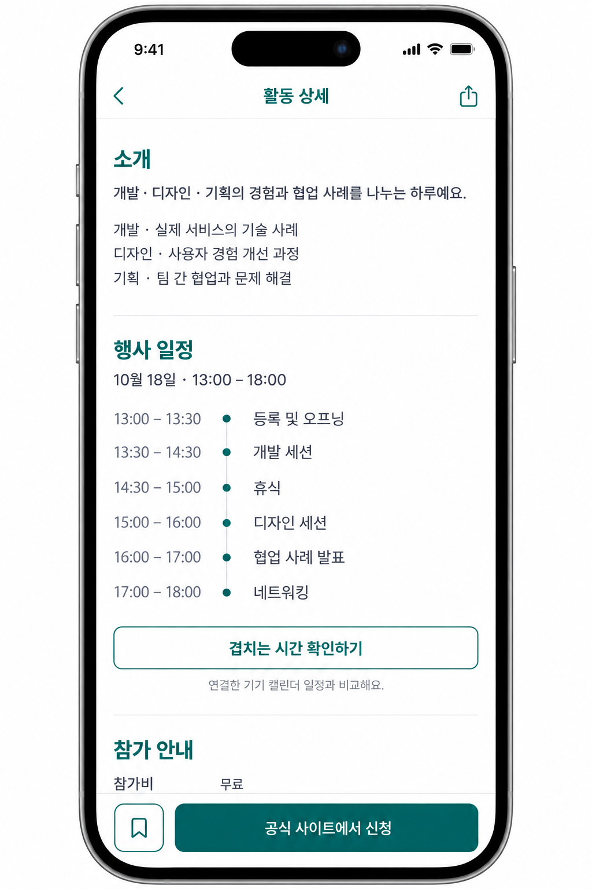
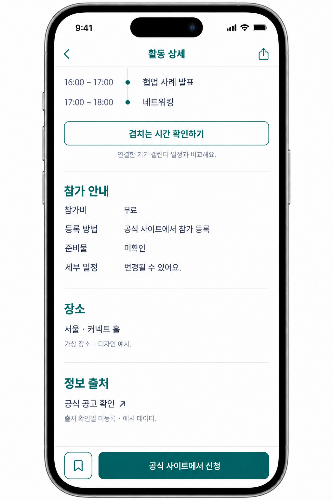

Note:
selected/01-current-flow 승인 시안. 외부 사이트에서 실제 신청하며 Dearby가 주최 측의 접수 성공을 자동 확인하는 것은 아니다.

---
<!-- .slide: class="screens single" -->

## 신청 여부를 직접 기록

공식 사이트에서 신청한 뒤, 앱에 자신의 신청 상태를 남긴다.


Note:
selected/01-current-flow 승인 시안. 앱의 신청 기록은 사용자의 자기 기록이며 주최 측의 접수 확인·선발 결과와 구분한다.

---
<!-- .slide: class="screens single" -->

## 겹치는 시간 확인 · 시안 A

활동 시간과 기기 캘린더를 비교해 겹치는 구간과 길이를 보여 준다.

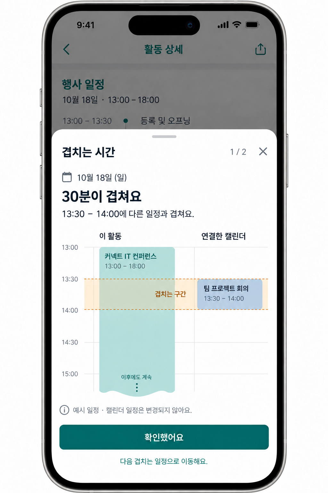

Note:
selected/04-calendar-needs-confirmation의 calendar-30min-a.png이며 이후 사용자가 A를 승인했다. 실제 기기 캘린더 비교 기능과 연결한 디자인이다. 이미지의 ‘팀 프로젝트 회의’는 예시 제목이다. 실제 구현은 개인 일정의 제목·위치·내용을 표시하거나 서버에 저장하지 않고 필요한 busy 구간을 메모리에서 비교한다. 정확한 시작·종료 시각과 캘린더 권한이 필요하다.

---
<!-- .slide: class="screens" -->

## 프로필과 비로그인 진입

자신의 소개와 활동 이력을 관리하고, 로그인 전에는 기능 범위를 안내한다.

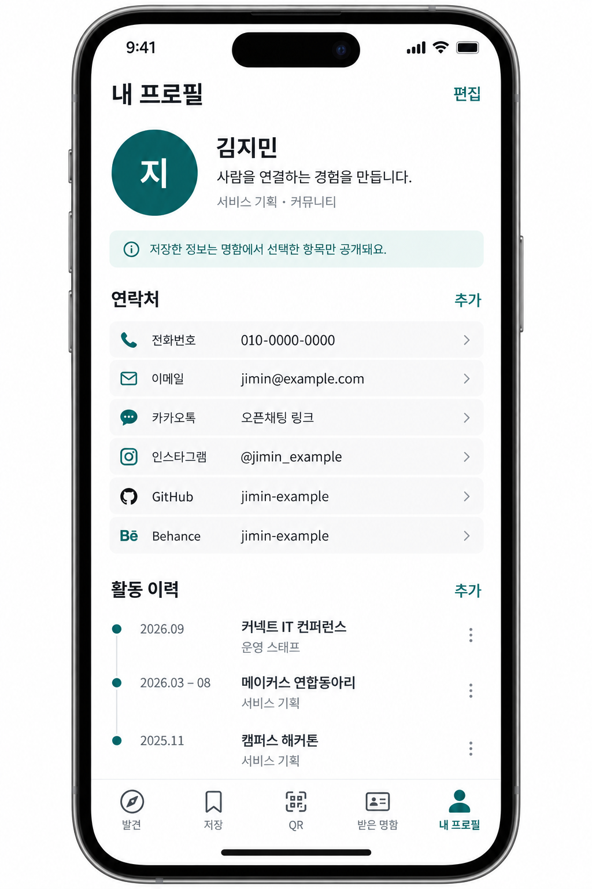
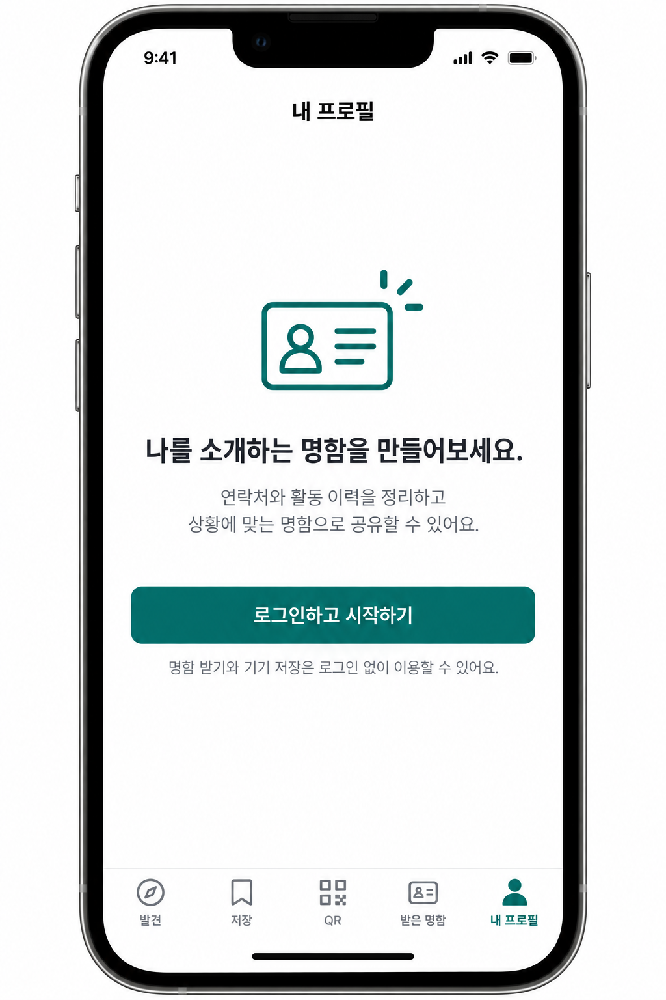

Note:
selected/02-other-approved 승인 시안. 여기부터는 명함 관련 디자인이다. 관련 파일과 첫 구현은 보존하고 있으나 현재 앱 기본 흐름에서는 명함·프로필 진입을 숨겼다. 전체 명함 서비스가 공개 운영 중이라는 의미는 아니다.

---
<!-- .slide: class="screens single" -->

## 공개할 정보로 명함 구성

공유할 연락처와 활동 이력을 골라 상황에 맞는 명함을 만든다.

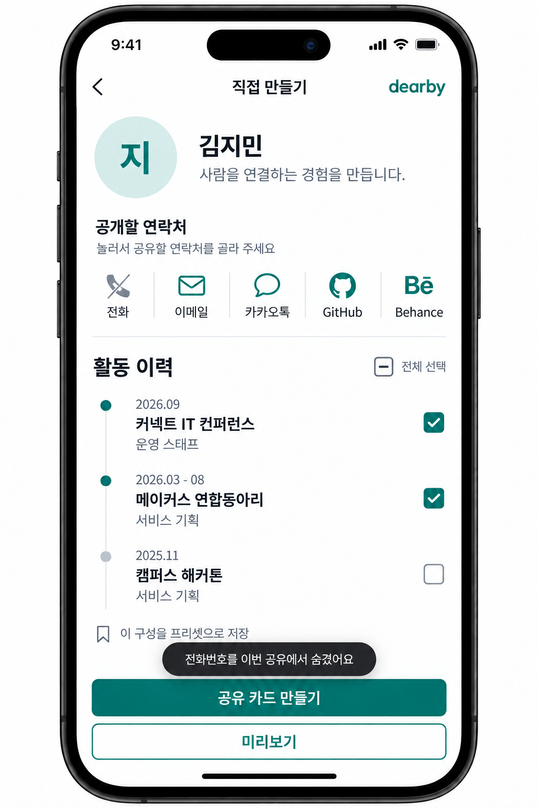

Note:
selected/02-other-approved 승인 시안, 현재 기본 노출에서는 숨김. 연락처 전체를 일괄 공개하지 않고 공유할 항목을 선택하는 것이 디자인의 핵심이다. 생성·게시·상대 명함함 전달은 인증 및 서버 성공과 구분해야 한다.

---
<!-- .slide: class="screens triple" -->

## 이차원 바코드로 명함 공유<sup>1</sup>

상황에 맞는 명함을 선택하고 이차원 바코드나 공유 메뉴로 전달한다.

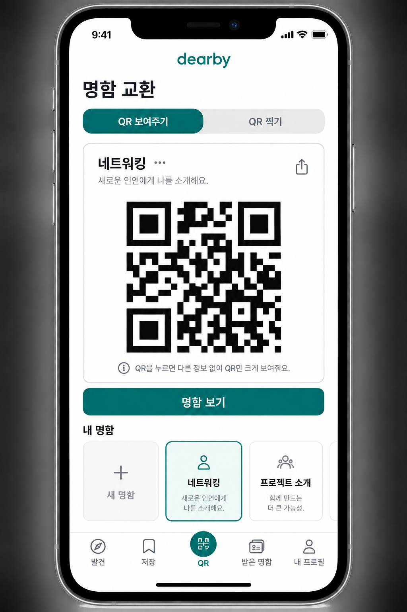
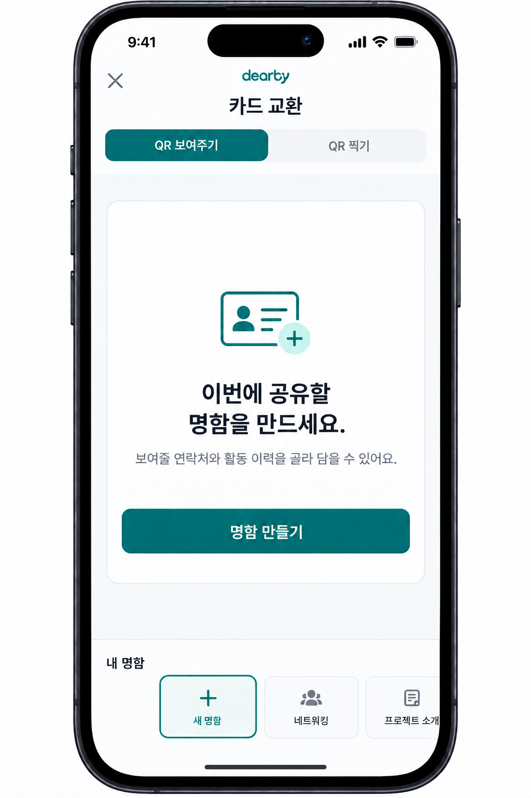
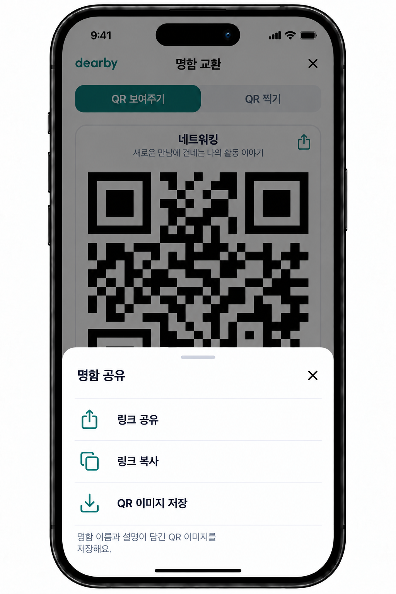

<div class="footnotes" role="note" aria-label="용어 설명">
<p><sup>1</sup> 이차원 바코드: 가로·세로의 무늬에 주소 등 정보를 담아 카메라로 읽는 코드. 원본 시안의 영문 표기는 이 코드를 뜻함.</p>
</div>

Note:
selected/02-other-approved 승인 시안, 현재 기본 노출에서는 숨김. 정적 시안 안의 이차원 바코드은 데모 이미지이며 유효한 실제 공유 링크를 보증하지 않는다.

---
<!-- .slide: class="screens" -->

## 이차원 바코드 읽기와 명함 확인<sup>1</sup>

상대의 이차원 바코드를 읽고 공개된 연락처·활동 이력을 확인한다.


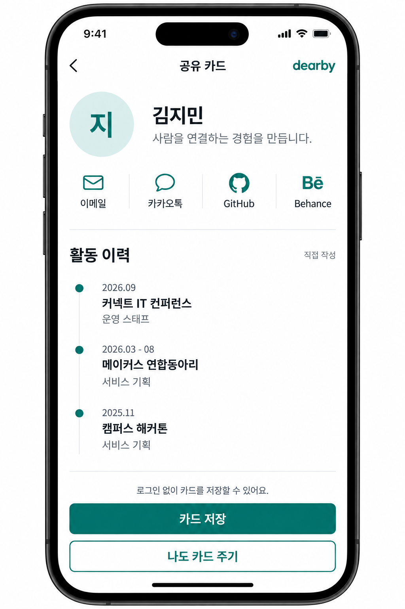

<div class="footnotes" role="note" aria-label="용어 설명">
<p><sup>1</sup> 이차원 바코드 읽기: 카메라가 코드 무늬를 해석해 공유 명함의 주소를 얻는 과정.</p>
</div>

Note:
selected/02-other-approved 승인 시안, 현재 기본 노출에서는 숨김. 상대가 공개한 범위만 보여 주는 흐름이다. 명함 저장과 상대방에게 내 명함을 보내는 동작은 별개로 다룬다.

---
<!-- .slide: class="screens" -->

## 받은 명함과 교환 상태

받은 명함을 모아 보고, 내 명함을 아직 보내지 않은 상대를 구분한다.

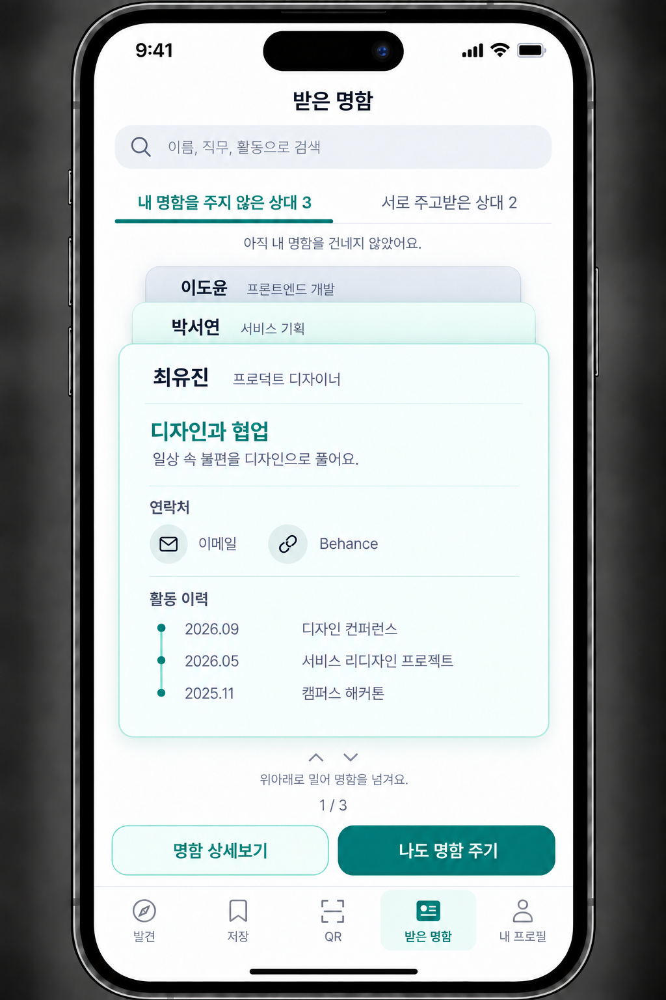
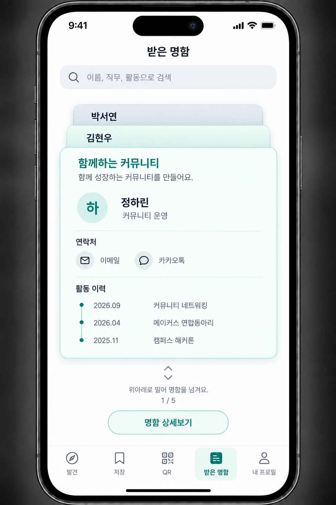

Note:
selected/02-other-approved 승인 시안, 현재 기본 노출에서는 숨김. 교환 상태를 알아볼 수 있게 하되 명함 열람만으로 자동 전달하지 않는 흐름이다.

---
<!-- .slide: class="screens single" -->

## 보낼 명함 선택

상대에게 전달할 명함을 확인하고, 공개 범위를 선택한 뒤 보낸다.

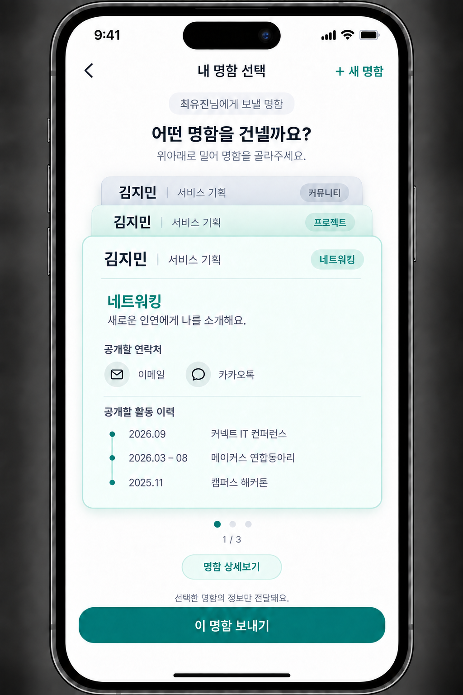

Note:
selected/02-other-approved 승인 시안, 현재 기본 노출에서는 숨김. 명함 관련 디자인의 마지막 단계다. 발표 후 질문에서는 데이터 정제·검색 품질·개인정보 공개 범위를 중심으로 개선 의견을 받는다.
